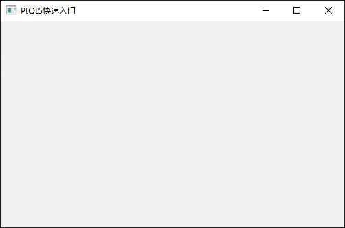
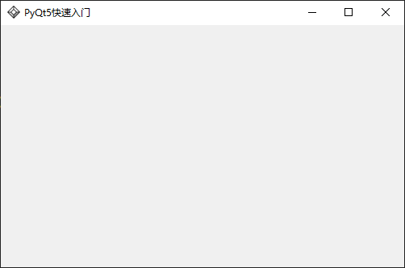
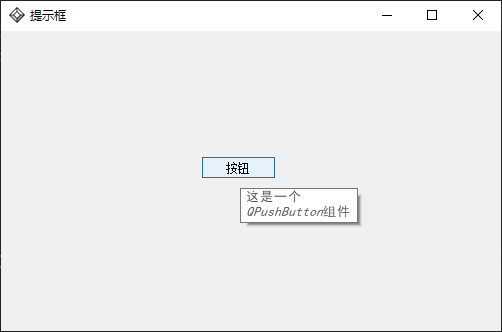
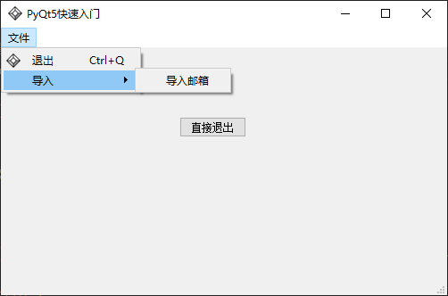
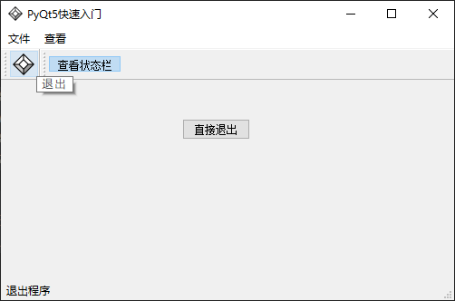
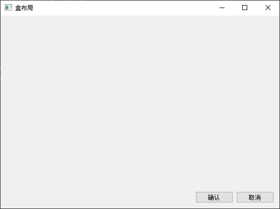
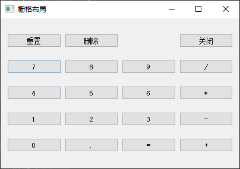
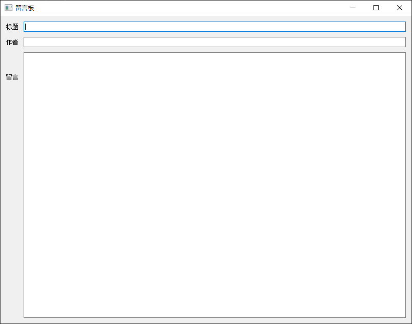
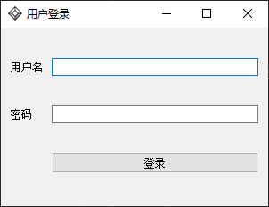
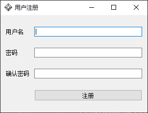

PyQt5学习笔记。

参考链接：

- [lxgzhw520/PyQT5-Tutorial: 理想国PyQT5零基础入门教程 (github.com)](https://github.com/lxgzhw520/PyQT5-Tutorial)

<!-- more -->

## 快速入门

### 基本框架

> QWidget QApplication

```python
import sys
from PyQt5.QtWidgets import QApplication, QWidget	# PyQt5.QtWidgets模块包含了各种基本组件

if __name__ == '__main__':
    app = QApplication(sys.argv)	# 创建一个Qt应用对象，传递命令行参数列表
    
    w = QWidget()		# 注册一个QWidget控件，它是一个用户界面的基本控件。默认情况下控件没有父级，没有父级的组件称为窗口(windows)
    w.resize(500, 300)	# 设置控件大小，先宽后高，单位：px
    w.move(800, 300)	# 设置控件位置，先横后竖，单位：px，原点在屏幕左上角
    w.setWindowTitle("PyQt5快速入门")	# 设置标题栏
    w.show()			# 显示控件，控件现在内存创建，使用.show()方法才显示到桌面
    
    sys.exit(app.exec_())	# 调用app.exec_()进入应用主循环，事件处理器开始工作。
    						# 主循环从窗口上接收事件，并把事件派发到应用控件中。
        					# 当调用exit()方法或直接销毁主控件(点击窗口右上角x号)时，主循环就会结束。
            				# sys.exit()方法能够确保主循环安全退出，外部环境能通知主控件怎么结束(？)
                			# app.exec_()之所以有个下划线，是因为exec是python的一个关键字
```



### 窗口图标

> QIcon

窗口图标通常显示在窗口的左上角，标题栏的最左边。

可以在上一节的代码（过程式编程）中添加以下语句：

```python
from PyQt5.QtGui import QIcon
...
w.setWindowIcon(QIcon("logo.png")) # 也可以是其他格式的图片，如.ico等
```

但使用面向对象的编程方式，新建一个类，是更常用的写法：

```python
import sys
from PyQt5.QtWidgets import QApplication, QWidget
from PyQt5.QtGui import QIcon

class QuickStart(QWidget):
    def __init__(self):
        super().__init__()	# super()返回父类构造器的对象
        self.initUI()
        
    def initUI(self):
        self.setGeometry(800, 300, 500, 300)  # 设计几何体参数，ax,ay,aw,ah，先位置，后大小
        self.setWindowTitle("PyQt5快速入门")	# 这几个方法都继承自QWidget
        self.setWindowIcon(QIcon("logo.png")) # 先使用QIcon接收一个路径参数，创建一个QIcon对象，然后使用setWindowIcon()设置图标
        self.show()
        
if __name__ == '__main__':
    app = QApplication(sys.argv)	# 创建应用
    qs = QuickStart()				# 创建窗口对象
    sys.exit(app.exec_())			# 应用主循环开始
```



### 提示框

> QToolTip QPushButton
>
> QFont

```python
import sys
from PyQt5.QtWidgets import (QWidget, QToolTip,
                             QPushButton, QApplication)
from PyQt5.QtGui import QFont, QIcon

class QuickStart(QWidget):
    def __init__(self):
        super().__init__()
        self.initUI()
        
    def initUI(self):
        # 设置提示框字体
        QToolTip.setFont(QFont("SimHei", 10)) # 使用中文字体，不然中文会乱码，10px
        # 设置鼠标悬浮提示信息
        self.setToolTip("这是一个<b>QWidget</b>组件")	# 支持富文本格式，标签b-粗体
        # 创建按钮
        btn = QPushButton("按钮", self) # 指定父级对象为当前控件
        btn.setToolTip("这是一个<i>QPushButton</i>组件") # 标签i-斜体
        # 设置按钮的大小和位置
        btn.resize(btn.sizeHint())	# sizeHint()方法提供一个默认的按钮大小
        btn.move(200, 125) # 以父对象的左上角为原点
        # 设置窗口的位置和大小
        self.setGeometry(800, 300, 500, 300)
        # 设置窗口的标题
        self.setWindowTitle("提示框")
        # 设置图标
        self.setWindowIcon(QIcon("logo.png"))
        # 显示窗口
        self.show()
        
if __name__ == '__main__':
    app = QApplication(sys.argv)	# 创建应用
    qs = QuickStart()				# 创建窗口对象
    sys.exit(app.exec_())			# 应用主循环开始
```



### 关闭窗口

> btn.clicked.connect(func)

关闭窗口除了点击右上角的❌，也可以通过程序来完成。

涉及到`single`和`slot`的知识。感觉可以理解为事件回调函数。

```python
import sys
from PyQt5.QtWidgets import QWidget, QPushButton, QToolTip, QApplication
from PyQt5.QtCore import QCoreApplication
from PyQt5.QtGui import QIcon, QFont

class QuickStart(QWidget):
    def __init__(self):
        super().__init__()
        self.initUI()
        
    def initUI(self):
        # 创建退出按钮
        btn = QPushButton("退出", self)
        # 注册点击事件为退出事件(点击的回调函数为应用退出函数)
        btn.clicked.connect(QCoreApplication.instance().quit)
		# 设置退出按钮提示
        QToolTip.setFont(QFont("simHei", 10))
        btn.setToolTip("点击退出程序")
        
        btn.move(50, 50)
        btn.resize(btn.sizeHint())

        self.setGeometry(800, 300, 500, 300)
        self.setWindowTitle("PyQt5快速入门")
        self.setWindowIcon(QIcon("logo.png"))
        self.show()
        
if __name__ == '__main__':
    app = QApplication(sys.argv)	# 创建应用
    qs = QuickStart()				# 创建窗口对象
    sys.exit(app.exec_())			# 应用主循环开始
```

也可以自定义回调函数，如：

```python
def initUI(self):
    # 创建退出按钮
    btn = QPushButton("退出", self)
    # 注册点击事件为退出事件(点击的回调函数为应用退出函数)
    btn.clicked.connect(self.btnClicked)
    # 设置退出按钮提示
    QToolTip.setFont(QFont("simHei", 10))
    btn.setToolTip("点击退出程序")

    btn.move(50, 50)
    btn.resize(btn.sizeHint())

    self.setGeometry(800, 300, 500, 300)
    self.setWindowTitle("PyQt5快速入门")
    self.setWindowIcon(QIcon("logo.png"))
    self.show()

def btnClicked(self):
    print("退出程序")
    QCoreApplication.instance().quit()
    print("程序已退出")
```

### 消息盒子

> QMessageBox

```python
import sys
from PyQt5.QtWidgets import QApplication, QWidget, QPushButton, QToolTip, QMessageBox
from PyQt5.QtCore import QCoreApplication
from PyQt5.QtGui import QIcon, QFont

class QuickStart(QWidget):
    def __init__(self):
        super().__init__()
        self.initUI()
        
    def initUI(self):
        self.setGeometry(800, 300, 500, 300)
        self.setWindowTitle("PyQt5快速入门")
        self.setWindowIcon(QIcon("logo.png"))
        self.show()
    
    # 关闭窗口时，会给窗口传递一个QCloseEvent事件，调用窗口的closeEvent函数
    def closeEvent(self, event): 	# 这里重写父类的closeEvent函数，替换默认的事件处理函数，也就改变了默认行为
        """退出事件"""
        reply = QMessageBox.question(self, "消息", "您确定要退出吗？", 
                                    QMessageBox.Yes | QMessageBox.No, QMessageBox.No)
        if reply == QMessageBox.Yes:
            event.accept()	# 接收事件，继续传递，执行后续关闭操作
        else:
            event.ignore()	# 忽略，不再往下传递此次关闭事件
        
if __name__ == '__main__':
    app = QApplication(sys.argv)	# 创建应用
    qs = QuickStart()				# 创建窗口对象
    sys.exit(app.exec_())			# 应用主循环开始
```

### 窗口居中

```python
import sys
from PyQt5.QtWidgets import QApplication, QWidget, QPushButton, QMessageBox, QDesktopWidget
from PyQt5.QtCore import QCoreApplication
from PyQt5.QtGui import QIcon, QFont

class QuickStart(QWidget):
    def __init__(self):
        super().__init__()
        self.initUI()
        
    def initUI(self):
        self.setGeometry(800, 300, 500, 300)
        self.setWindowTitle("PyQt5快速入门")
        self.setWindowIcon(QIcon("logo.png"))
        self.center()

        btn = QPushButton("直接退出", self)
        btn.resize(btn.sizeHint())
        btn.move(200, 100)
        btn.clicked.connect(QCoreApplication.instance().quit)
        
        self.show()
    
    def closeEvent(self, event):
        """退出事件"""
        reply = QMessageBox.question(self, "消息", "您确定要退出吗？", 
                                    QMessageBox.Yes | QMessageBox.No, QMessageBox.No)
        if reply == QMessageBox.Yes:
            event.accept()
        else:
            event.ignore()

    def center(self):
        window_frame = self.frameGeometry()	# 获得主窗口所在框架
        desktop_center = QDesktopWidget().availableGeometry().center()	# 获取显示器框架，并得到屏幕中心点的位置
        window_frame.moveCenter(desktop_center)	# 将主窗口框架的中心，移到屏幕中心
        self.move(window_frame.topLeft())	# 然后，通过move函数，把主窗口的左上角，移到主窗口框架的左上角哎，完成居中

if __name__ == '__main__':
    app = QApplication(sys.argv)	# 创建应用
    qs = QuickStart()				# 创建窗口对象
    sys.exit(app.exec_())			# 应用主循环开始
```

### 状态栏

QWidget本身是没有状态栏和菜单栏的，但QMainWindow（继承自QWidget）提供了常用的主窗口功能，能够用来创建一些状态栏、工具栏和菜单栏。

状态栏用于显示应用的状态信息。

```python
import sys
from PyQt5.QtWidgets import QApplication, QMainWindow, QPushButton, QMessageBox, QToolTip, QDesktopWidget
from PyQt5.QtCore import QCoreApplication
from PyQt5.QtGui import QIcon, QFont

class QuickStart(QMainWindow):
    def __init__(self):
        super().__init__()
        self.initUI()
        
    def initUI(self):
        # 设置提示框的字体
        QToolTip.setFont(QFont("simHei", 10))
        
        # 创建直接退出按钮
        btn = QPushButton("直接退出", self)
        btn.resize(btn.sizeHint())
        btn.move(200, 100)
        btn.clicked.connect(QCoreApplication.instance().quit)
        
        # 设置状态栏
        self.statusBar().showMessage("状态栏")
        self.setGeometry(800, 300, 500, 300)
        self.setWindowTitle("PyQt5快速入门")
        self.setWindowIcon(QIcon("logo.png"))
        self.center()
        self.show()
    
    def closeEvent(self, event):
        """退出事件"""
        reply = QMessageBox.question(self, "消息", "您确定要退出吗？", 
                                    QMessageBox.Yes | QMessageBox.No, QMessageBox.No)
        if reply == QMessageBox.Yes:
            event.accept()
        else:
            event.ignore()

    def center(self):
        window_frame = self.frameGeometry()	# 获得主窗口所在框架
        desktop_center = QDesktopWidget().availableGeometry().center()	# 获取显示器框架，并得到屏幕中心点的位置
        window_frame.moveCenter(desktop_center)	# 将主窗口框架的中心，移到屏幕中心
        self.move(window_frame.topLeft())	# 然后，通过move函数，把主窗口的左上角，移到主窗口框架的左上角哎，完成居中

if __name__ == '__main__':
    app = QApplication(sys.argv)	# 创建应用
    qs = QuickStart()				# 创建窗口对象
    sys.exit(app.exec_())			# 应用主循环开始
```

### 菜单栏

```python
import sys
from PyQt5.QtWidgets import QApplication, QMainWindow, QDesktopWidget, qApp
from PyQt5.QtWidgets import QPushButton, QMessageBox, QToolTip, QAction
from PyQt5.QtCore import QCoreApplication
from PyQt5.QtGui import QIcon, QFont

class QuickStart(QMainWindow):
    def __init__(self):
        super().__init__()
        self.initUI()
        
    def initUI(self):
        # 设置提示框的字体
        QToolTip.setFont(QFont("simHei", 10))
        
        # 创建直接退出按钮
        btn = QPushButton("直接退出", self)
        btn.resize(btn.sizeHint())
        btn.move(200, 100)
        btn.clicked.connect(QCoreApplication.instance().quit)
        
        # 设置状态栏
        self.statusBar().showMessage("状态栏")  # 状态栏初始信息
        
        # 设置菜单栏
        menubar = self.menuBar() # 创建菜单栏
        fileMenu = menubar.addMenu("&文件") # 创建文件菜单

        exitAct = QAction(QIcon("exit.png"), "&退出", self) # 创建动作
        exitAct.setStatusTip("退出程序")    # 设置鼠标悬浮时的状态栏信息
        exitAct.setShortcut("Ctrl+Q")   # 设置快捷键
        exitAct.triggered.connect(qApp.quit) # 触发==点击或使用了快捷键

        fileMenu.addAction(exitAct) # 向文件菜单中添加行为
        
        self.setGeometry(800, 300, 500, 300)
        self.setWindowTitle("PyQt5快速入门")
        self.setWindowIcon(QIcon("logo.png"))
        self.center()
        self.show()
    
    def closeEvent(self, event):
        """退出事件"""
        reply = QMessageBox.question(self, "消息", "您确定要退出吗？", 
                                    QMessageBox.Yes | QMessageBox.No, QMessageBox.No)
        if reply == QMessageBox.Yes:
            event.accept()
        else:
            event.ignore()

    def center(self):
        window_frame = self.frameGeometry()	# 获得主窗口所在框架
        desktop_center = QDesktopWidget().availableGeometry().center()	# 获取显示器框架，并得到屏幕中心点的位置
        window_frame.moveCenter(desktop_center)	# 将主窗口框架的中心，移到屏幕中心
        self.move(window_frame.topLeft())	# 然后，通过move函数，把主窗口的左上角，移到主窗口框架的左上角哎，完成居中

if __name__ == '__main__':
    app = QApplication(sys.argv)	# 创建应用
    qs = QuickStart()				# 创建窗口对象
    sys.exit(app.exec_())			# 应用主循环开始
```

### 子菜单

> QMenu

```python
import sys
from PyQt5.QtWidgets import QApplication, QMainWindow, QDesktopWidget, qApp, QMenu
from PyQt5.QtWidgets import QPushButton, QMessageBox, QToolTip, QAction
from PyQt5.QtCore import QCoreApplication
from PyQt5.QtGui import QIcon, QFont

class QuickStart(QMainWindow):
    def __init__(self):
        super().__init__()
        self.initUI()
        
    def initUI(self):
        # 设置提示框的字体
        QToolTip.setFont(QFont("simHei", 10))
        
        # 创建直接退出按钮
        exitButton = QPushButton("直接退出", self)
        exitButton.resize(exitButton.sizeHint())
        exitButton.move(200, 100)
        exitButton.clicked.connect(QCoreApplication.instance().quit)
        
        # 设置状态栏
        self.statusBar().showMessage("状态栏")  # 状态栏初始信息
        
        # 设置菜单栏
        # 动作
        exitAction = QAction(QIcon("exit.png"), "&退出", self) # &有影响，但不明显，暂时忽略
        exitAction.setStatusTip("退出程序")
        exitAction.setShortcut("Ctrl+Q")
        exitAction.triggered.connect(qApp.quit)
        
        newAction = QAction(QIcon("new,png"), "&新建", self)
        
        impAction = QAction("导入邮箱", self)
        
		# 导入子菜单
        impMenu = QMenu("导入", self)
        impMenu.addAction(impAction)
        
        # 菜单栏
        menubar = self.menuBar() # 创建菜单栏
        fileMenu = menubar.addMenu("&文件") # 创建文件菜单
        fileMenu.addAction(exitAction)
        fileMenu.addMenu(impMenu)
        
        self.setGeometry(800, 300, 500, 300)
        self.setWindowTitle("PyQt5快速入门")
        self.setWindowIcon(QIcon("logo.png"))
        self.center()
        self.show()
    
    def closeEvent(self, event):
        """退出事件"""
        isExit = QMessageBox.question(self, "消息", "您确定要退出吗？", 
                                    QMessageBox.Yes | QMessageBox.No, QMessageBox.No)
        if isExit == QMessageBox.Yes:
            event.accept()
        else:
            event.ignore()

    def center(self):
        frame = self.frameGeometry()	# 获得主窗口所在框架
        screen_center = QDesktopWidget().availableGeometry().center()	# 获取显示器框架，并得到屏幕中心点的位置
        frame.moveCenter(screen_center)	# 将主窗口框架的中心，移到屏幕中心
        self.move(frame.topLeft())	# 然后，通过move函数，把主窗口的左上角，移到主窗口框架的左上角哎，完成居中

if __name__ == '__main__':
    app = QApplication(sys.argv)	# 创建应用
    qs = QuickStart()				# 创建窗口对象
    sys.exit(app.exec_())			# 应用主循环开始
```



### 勾选菜单

```python
import sys
from PyQt5.QtWidgets import QApplication, QMainWindow, QDesktopWidget, qApp, QMenu
from PyQt5.QtWidgets import QPushButton, QMessageBox, QToolTip, QAction
from PyQt5.QtCore import QCoreApplication
from PyQt5.QtGui import QIcon, QFont

class QuickStart(QMainWindow):
    def __init__(self):
        super().__init__()
        self.initUI()
        
    def initUI(self):
        # 设置提示框的字体
        QToolTip.setFont(QFont("simHei", 10))
        
        # 创建直接退出按钮
        exitButton = QPushButton("直接退出", self)
        exitButton.resize(exitButton.sizeHint())
        exitButton.move(200, 100)
        exitButton.clicked.connect(QCoreApplication.instance().quit)
        
        # 设置状态栏
        self.statusBar().showMessage("状态栏")  # 状态栏初始信息
        
        # 设置菜单栏
        # 动作
        exitAction = QAction(QIcon("exit.png"), "&退出", self) # &有影响，但不明显，暂时忽略
        exitAction.setStatusTip("退出程序")
        exitAction.setShortcut("Ctrl+Q")
        exitAction.triggered.connect(qApp.quit)
        
        newAction = QAction(QIcon("new,png"), "&新建", self)
        
        impAction = QAction("导入邮箱", self)
        
        viewStatAction = QAction("查看状态栏", self)
        viewStatAction.setCheckable(True)
        viewStatAction.setChecked(True)
        viewStatAction.setStatusTip("查看状态栏")
        viewStatAction.triggered.connect(self.toggleMenu) # 切换菜单
        
		# 导入子菜单
        impMenu = QMenu("导入", self)
        impMenu.addAction(impAction)
        
        # 文件菜单
        fileMenu = QMenu("&文件", self) # 创建文件菜单
        fileMenu.addAction(exitAction)
        fileMenu.addMenu(impMenu)
        
        # 勾选菜单
        viewMenu = QMenu("&查看", self)
        viewMenu.addAction(viewStatAction)
        
        # 菜单栏
        menubar = self.menuBar() # 创建菜单栏
        menubar.addMenu(fileMenu)
        menubar.addMenu(viewMenu)
        
        
        self.setGeometry(800, 300, 500, 300)
        self.setWindowTitle("PyQt5快速入门")
        self.setWindowIcon(QIcon("logo.png"))
        self.center()
        self.show()
   
    def toggleMenu(self, state):
        if state:
            self.statusBar().show()
        else:
            self.statusBar().hide()

    def closeEvent(self, event):
        """退出事件"""
        isExit = QMessageBox.question(self, "消息", "您确定要退出吗？", 
                                    QMessageBox.Yes | QMessageBox.No, QMessageBox.No)
        if isExit == QMessageBox.Yes:
            event.accept()
        else:
            event.ignore()

    def center(self):
        frame = self.frameGeometry()	# 获得主窗口所在框架
        screen_center = QDesktopWidget().availableGeometry().center()	# 获取显示器框架，并得到屏幕中心点的位置
        frame.moveCenter(screen_center)	# 将主窗口框架的中心，移到屏幕中心
        self.move(frame.topLeft())	# 然后，通过move函数，把主窗口的左上角，移到主窗口框架的左上角哎，完成居中

if __name__ == '__main__':
    app = QApplication(sys.argv)	# 创建应用
    qs = QuickStart()				# 创建窗口对象
    sys.exit(app.exec_())			# 应用主循环开始
```

### 右键菜单

右键菜单也是菜单(QMenu)。

在上一节的代码中添加以下方法：

```python
# 菜单栏右键菜单
    def contextMenuEvent(self, QContextMenuEvent):
        rightClickMenu = QMenu(self)
        newAction = rightClickMenu.addAction("新建")
        openAction = rightClickMenu.addAction("打开")
        quitAction = rightClickMenu.addAction("退出")
        # 监听点击动作绑定的事件
        action = rightClickMenu.exec_(self.mapToGlobal(QContextMenuEvent.pos())) # .exec_()方法用来显示菜单，从鼠标右键事件中获得当前相对坐标，然后再转换为绝对坐标
        if action == quitAction:
            qApp.quit()
```

### 工具栏

菜单栏包含所有的命令，工具栏则是常用命令的集合。(不一定，有时候工具栏比菜单栏还要丰富)

菜单栏只有一个，工具栏可以有多个。

```python
import sys
from PyQt5.QtWidgets import QApplication, QMainWindow, QDesktopWidget, qApp, QMenu
from PyQt5.QtWidgets import QPushButton, QMessageBox, QToolTip, QAction
from PyQt5.QtCore import QCoreApplication
from PyQt5.QtGui import QIcon, QFont

class QuickStart(QMainWindow):
    def __init__(self):
        super().__init__()
        self.initUI()
        
    def initUI(self):
        # 设置提示框的字体
        QToolTip.setFont(QFont("simHei", 10))
        
        # 直接退出按钮
        exitButton = QPushButton("直接退出", self)
        exitButton.resize(exitButton.sizeHint())
        exitButton.move(200, 100)
        exitButton.clicked.connect(QCoreApplication.instance().quit)
        
        # 状态栏
        self.statusBar().showMessage("状态栏")  # 状态栏初始信息
        
        # 设置菜单栏
        # 一级动作
        exitAction = QAction(QIcon("exit.png"), "&退出", self) # &有影响，但不明显，暂时忽略
        exitAction.setStatusTip("退出程序")
        exitAction.setShortcut("Ctrl+Q")
        exitAction.triggered.connect(qApp.quit)
        
        viewStatAction = QAction("查看状态栏", self)
        viewStatAction.setCheckable(True)
        viewStatAction.setChecked(True)
        viewStatAction.setStatusTip("查看状态栏")
        viewStatAction.triggered.connect(self.toggleMenu) # 切换菜单
        
        # 一级菜单：文件
        fileMenu = QMenu("&文件", self) # 创建文件菜单
        fileMenu.addAction(exitAction)
        fileMenu.addMenu(self.impMenu())
        fileMenu.addMenu(self.newMenu())
        
        # 一级菜单：查看
        viewMenu = QMenu("&查看", self)
        viewMenu.addAction(viewStatAction)
        
        # 菜单栏
        menubar = self.menuBar() # 创建菜单栏
        menubar.addMenu(fileMenu)
        menubar.addMenu(viewMenu)

        # 工具栏
        self.toobar = self.addToolBar("退出")
        self.toobar.addAction(exitAction)
        self.toobar = self.addToolBar("查看")
        self.toobar.addAction(viewStatAction)

        self.setGeometry(800, 300, 500, 300)
        self.setWindowTitle("PyQt5快速入门")
        self.setWindowIcon(QIcon("logo.png"))
        self.center()
        self.show()

    # 二级菜单：新建
    def newMenu(self):
        menu = QMenu("新建", self)
        new_pythonfile = QAction("新建Python文件", self)
        menu.addAction(new_pythonfile)
        return menu
    
    # 二级菜单：导入
    def impMenu(self):
        menu = QMenu("导入", self)
        impAction = QAction("导入邮箱", self)
        menu.addAction(impAction)
        return menu
        
    # 菜单栏右键菜单
    def contextMenuEvent(self, QContextMenuEvent):
        rightClickMenu = QMenu(self)
        newAction = rightClickMenu.addAction("新建")
        openAction = rightClickMenu.addAction("打开")
        quitAction = rightClickMenu.addAction("退出")
        # 监听点击动作绑定的事件
        action = rightClickMenu.exec_(self.mapToGlobal(QContextMenuEvent.pos())) # .exec_()方法用来显示菜单，从鼠标右键事件中获得当前相对坐标，然后再转换为绝对坐标
        if action == quitAction:
            qApp.quit()

    def toggleMenu(self, state):
        if state:
            self.statusBar().show()
        else:
            self.statusBar().hide()

    def closeEvent(self, event):
        """退出事件"""
        isExit = QMessageBox.question(self, "消息", "您确定要退出吗？", 
                                    QMessageBox.Yes | QMessageBox.No, QMessageBox.No)
        if isExit == QMessageBox.Yes:
            event.accept()
        else:
            event.ignore()

    def center(self):
        frame = self.frameGeometry()	# 获得主窗口所在框架
        screen_center = QDesktopWidget().availableGeometry().center()	# 获取显示器框架，并得到屏幕中心点的位置
        frame.moveCenter(screen_center)	# 将主窗口框架的中心，移到屏幕中心
        self.move(frame.topLeft())	# 然后，通过move函数，把主窗口的左上角，移到主窗口框架的左上角哎，完成居中

if __name__ == '__main__':
    app = QApplication(sys.argv)	# 创建应用
    qs = QuickStart()				# 创建窗口对象
    sys.exit(app.exec_())			# 应用主循环开始
```



当QAction设置了图标时，工具栏优先使用图标，没有图标时，再使用文字。

### 主窗口

封装一个App类，QuickStartApp.py

```python
import sys
from PyQt5.QtWidgets import QMainWindow, QMenu, QAction, qApp, QApplication
from PyQt5.QtWidgets import QMessageBox, QToolTip, QPushButton, QDesktopWidget
from PyQt5.QtCore import QCoreApplication
from PyQt5.QtGui import QIcon, QFont

class QuickStartApp(QMainWindow):
    def __init__(self):
        super().__init__()
        self.setWindowIcon(QIcon("logo.png"))
        self.resize(800, 600)
        self.center()
        self.show()

    def closeEvent(self, event):
        isExit = QMessageBox.question(
            self, "退出确认", "您确定要退出程序吗？",
            QMessageBox.Yes | QMessageBox.No,
            QMessageBox.No
        )
        if isExit == QMessageBox.Yes:
            event.accept()
        else:
            event.ignore()

    def center(self):
        frame = self.frameGeometry()
        screen_enter = QDesktopWidget().availableGeometry().center()
        frame.moveCenter(screen_enter)
        self.move(frame.topLeft())
```

main.py

```python
import sys
from PyQt5.QtWidgets import QMainWindow, QMenu, QAction, qApp, QApplication, QDesktopWidget
from PyQt5.QtWidgets import QMessageBox, QToolTip, QPushButton, QTextEdit
from PyQt5.QtCore import QCoreApplication
from PyQt5.QtGui import QIcon, QFont

from QuickStartApp import QuickStartApp

class App(QuickStartApp):
    def __init__(self):
        super().__init__()
        self.initUI()

    def initUI(self):
        self.setWindowTitle("演示主窗口的使用")

        text_edit = QTextEdit() # 创建一个文本编辑框
        self.setCentralWidget(text_edit) # 占满整个主窗口

        self.getMenuBar() # 添加菜单栏
        self.getStatusBar() # 添加状态栏
        self.getToolBar() # 添加工具栏

        self.show()

    def getMenuBar(self):
        menu_bar = self.menuBar()
        file_menu = menu_bar.addMenu("&文件")
        file_menu.addAction(self.getExitAction())
        # view_menu = menu_bar.addMenu("&查看")

    def getExitAction(self):
        exit_action = QAction("退出", self)
        exit_action.setShortcut("Ctrl+Q")
        exit_action.setStatusTip("退出程序")
        exit_action.triggered.connect(self.close)
        return exit_action
    
    def getStatusBar(self):
        self.statusBar().showMessage("状态栏")

    def getToolBar(self):
        tool_bar = self.addToolBar("退出")
        tool_bar.addAction(self.getExitAction()) # 内存中出现两份exit_action，可以优化
    

if __name__ == "__main__":
    app = QApplication(sys.argv)
    qs = App()
    sys.exit(app.exec_())
```

### 绝对定位

```python
import sys
from PyQt5.QtWidgets import QApplication, QLabel

from QuickStartApp import QuickStartApp

class App(QuickStartApp):
    def __init__(self):
        super().__init__()
        self.initUI()

    def initUI(self):
        label1 = QLabel("label1", self)
        label1.move(33, 10)		# 绝对定位
        label1.show()

        label2 = QLabel("label2", self)
        label2.move(66, 30)
        label2.show()
        
        label3 = QLabel("label3", self)
        label3.move(99, 60)
        label3.show()

        self.setWindowTitle("绝对定位")
        self.show()

if __name__ == "__main__":
    app = QApplication(sys.argv)
    qs = App()
    sys.exit(app.exec_())
```

### 盒布局

盒布局有更强的适应性

- 水平布局 - QHBoxLayout
- 垂直布局 - QVBoxLayout
- 添加弹性空间 - addStretch

```python
import sys
from PyQt5.QtWidgets import QApplication, QPushButton, QHBoxLayout, QVBoxLayout, QWidget

class App(QWidget):
    def __init__(self):
        super().__init__()
        self.initUI()

    def initUI(self):
        button_ok = QPushButton("确认", self)
        button_cancel = QPushButton("取消", self)

        # 创建水平布局盒子
        hbox = QHBoxLayout()    
        hbox.addStretch(1)	# 在按钮前添加弹性控件
        hbox.addWidget(button_ok)
        hbox.addWidget(button_cancel)

        # 创建垂直布局盒子
        vbox = QVBoxLayout()
        vbox.addStretch(1) # 在hbox上面添加弹性空间
        vbox.addLayout(hbox)

        # 设置布局
        self.setLayout(vbox)

        self.setWindowTitle("盒布局")
        self.show()
        

if __name__ == "__main__":
    app = QApplication(sys.argv)
    qs = App()
    sys.exit(app.exec_())
```



### 栅格布局

栅格布局是最常用的布局，它把窗口分为行和列。

使用QGridLayout模块创建和使用栅格布局。

```python
import sys
from PyQt5.QtWidgets import QApplication, QPushButton, QGridLayout, QWidget

class App(QWidget):
    def __init__(self):
        super().__init__()
        self.initUI()

    def initUI(self):
        # 设置布局为栅格布局
        grid = QGridLayout()
        self.setLayout(grid)

        names = ['重置', '删除', '', '关闭',
                 '7', '8', '9', '/',
                 '4', '5', '6', '*',
                 '1', '2', '3', '-',
                 '0', '.', '=', '+']
        positions = [(i, j) for i in range(5) for j in range(4)]
        for position, name in zip(positions, names):
            print(position, name)
            if name == '':
                continue
            button = QPushButton(name)
            grid.addWidget(button, *position) # *用于元组解包

        self.setWindowTitle("栅格布局")
        self.show()
        

if __name__ == "__main__":
    app = QApplication(sys.argv)
    qs = App()
    sys.exit(app.exec_())
```



### 留言板

```python
import sys

from PyQt5.QtGui import QIcon
from PyQt5.QtWidgets import (
    QWidget, QLabel, QLineEdit, QTextEdit, QGridLayout, QApplication
)


class QuickStart(QWidget):
    def __init__(self):
        super().__init__()
        self.initUI()

    def initUI(self):
        self.setWindowTitle("留言板")
        self.setWindowIcon(QIcon("favicon.ico"))
        # 三个提示文本
        title = QLabel("标题")
        author = QLabel("作者")
        review = QLabel("留言")
        # 三个输入框
        titleEdit = QLineEdit()
        authorEdit = QLineEdit()
        reviewEdit = QTextEdit()

        # 创建栅格布局
        grid = QGridLayout()
        grid.setSpacing(10)

        # 将组建添加到栅格中
        grid.addWidget(title, 1, 0)
        grid.addWidget(author, 2, 0)
        grid.addWidget(review, 3, 0)
        grid.addWidget(titleEdit, 1, 1)
        grid.addWidget(authorEdit, 2, 1)
        grid.addWidget(reviewEdit, 3, 1, 5, 1)	# 跨5行，1列

        # 设置布局
        self.setLayout(grid)
        self.resize(800, 600)
        self.move(300, 300)
        self.show()


if __name__ == '__main__':
    app = QApplication(sys.argv)
    qs = QuickStart()
    sys.exit(app.exec_())
```




### 登录界面

```python
# _*_ coding:UTF-8 _*_
# 开发人员: 理想国真恵玩-张大鹏
# 开发团队: 理想国真恵玩
# 开发时间: 2019/11/20 19:49
# 文件名称: 17登录界面.py
# 开发工具: PyCharm

import sys
from PyQt5.QtWidgets import (
    QWidget, QLabel, QLineEdit, QTextEdit, QGridLayout, QApplication,
    QToolTip, QPushButton
)
from PyQt5.QtGui import (
    QIcon, QFont,
)


class QucikStart(QWidget):
    def __init__(self):
        super().__init__()
        self.initUI()

    def initUI(self):
        QToolTip.setFont(QFont("simHei", 12))
        # 创建栅格布局
        grid = QGridLayout()
        grid.setSpacing(10)

        # 用户名
        username = QLabel("用户名")
        usernameEdit = QLineEdit()
        grid.addWidget(username, 1, 0)
        grid.addWidget(usernameEdit, 1, 1)

        # 密码
        password = QLabel("密码")
        passwordEdit = QLineEdit()
        grid.addWidget(password, 2, 0)
        grid.addWidget(passwordEdit, 2, 1)

        # 登录按钮
        loginButton = QPushButton("登录")
        loginButton.setToolTip("点击登录")
        grid.addWidget(loginButton, 3, 1)

        # 设置窗口布局
        self.setLayout(grid)

        # 窗口
        self.setWindowIcon(QIcon("logo.png"))
        self.setWindowTitle("用户登录")
        self.resize(300, 200)
        self.move(300, 300)
        self.show()


if __name__ == '__main__':
    app = QApplication(sys.argv)
    qs = QucikStart()
    sys.exit(app.exec_())
```



### 注册界面

```python
import sys
from PyQt5.QtWidgets import (
    QWidget, QLabel, QLineEdit, QGridLayout, QApplication,
    QToolTip, QPushButton
)
from PyQt5.QtGui import (
    QIcon, QFont,
)


class QuickStart(QWidget):
    def __init__(self):
        super().__init__()
        self.initUI()

    def initUI(self):
        QToolTip.setFont(QFont("simHei", 12))
        # 创建栅格布局
        grid = QGridLayout()
        grid.setSpacing(10)

        # 用户名
        username = QLabel("用户名")
        usernameEdit = QLineEdit()
        grid.addWidget(username, 1, 0)
        grid.addWidget(usernameEdit, 1, 1)

        # 密码
        password = QLabel("密码")
        passwordEdit = QLineEdit()
        grid.addWidget(password, 2, 0)
        grid.addWidget(passwordEdit, 2, 1)

        # 确认密码
        password1 = QLabel("确认密码")
        password1Edit = QLineEdit()
        grid.addWidget(password1, 3, 0)
        grid.addWidget(password1Edit, 3, 1)

        # 登录按钮
        loginButton = QPushButton("注册")
        loginButton.setToolTip("点击注册")
        grid.addWidget(loginButton, 4, 1)

        # 设置窗口布局
        self.setLayout(grid)

        # 窗口
        self.setWindowIcon(QIcon("logo.png"))
        self.setWindowTitle("用户注册")
        self.resize(300, 200)
        self.move(300, 300)
        self.show()


if __name__ == '__main__':
    app = QApplication(sys.argv)
    qs = QuickStart()
    sys.exit(app.exec_())
```



## 基础知识

### 基础控件

#### QWidget

```shell
.resize()
.move()
.setGeometry()
.setWindowTitle()
.setWindowIcon()
.setToolTip()
.frameGeometry() # 获取控件所在框架的QRect
```

#### QMainWindow

```
.statusBar() .showMessage("")
.menuBar() .addMenu() .addAction() # 由于存在函数重载，.addMenu()的参数可以是QMenu，也可以是字符串
.setCentralWidget()
.close() # 产生QCloseEvent事件，调用closeEvent()世事件处理函数
```

#### QMenu

```
.addMenu()
.addAction()
.exec_(QPoint) # 在某个位置显示菜单，返回值类型为QAction
```

#### QAction

```
QAction(QIcon("exit.png"), "&退出", self)
.setStatusTip()
.setShortcut()
.triggered.connect()
.setCheckable()	# 创建一个可选中的行为项
.setChecked()	# True：默认选中
```

#### QPushButton

```
QPushButton(string text, QWidget paren=None) # text是按钮上的文字，第二个参数是为按钮指定的父级对象 
.setToolTip()
.resize()	# python存在函数重载，所以.resize既可以接收w,h两个整型参数，也可以接收PyQt5.QtCore.QSize(w,h)对象
.sizeHint()	# 返回默认的按钮大小
.move()
```

#### QTextEdit

```

```

#### QLineEdit

```

```

#### QLabel

```

```

#### QToolTip

```
 QToolTip.setFont() # 静态方法，设置提示框的字体
```

#### QCoreApplication

```
.instance().quit()
```

#### QMessageBox

```
.question(parent, title, text, optional_buttons, default_button) - QMessageBox.Yes | QMessageBox.No
```

#### QDesktopWidget

```
.availableGeometry() # 获取屏幕对应的QRec
```

#### xxxLayout

```
.addWidget()
.setSpacing() # 设置控件的上下间距
```

### 基本事件

#### closeEvent

- 窗口关闭事件

#### contextMenuEvent

- 右键菜单事件

### 注意点

QMainWindow中，不能直接放按钮之类的组件，QWidget可以。
