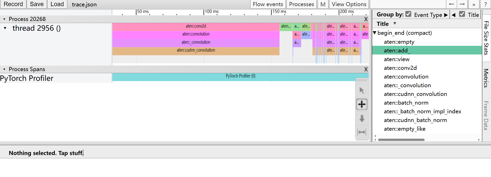

pytorch和神经网络学习笔记。

<!-- more -->

## 安装

官网地址：[Start Locally | PyTorch](https://pytorch.org/get-started/locally/)

例如：

```shell
pip3 install torch torchvision torchaudio --index-url https://download.pytorch.org/whl/cu118
```

如果网络老是中断，可以先从.whl文件安装torch

```python
pip install D:\Users\xxx\Downloads\torch-2.1.0+cu118-cp311-cp311-win_amd64.whl
```

然后在执行第一个命令，安装torchvision torchaudio。

## 神经网络概述

DNN (Deep Neural Network)、RNN (Recurrent Neural Network)、CNN (Convolutional Neural Network) 和图神经网络 (Graph Neural Network) 都是深度学习领域中常见的神经网络架构，它们各自适用于不同类型的数据和任务。以下是对每种神经网络的简要介绍：

1. 深度神经网络 (DNN):
   - DNN是一种标准的前馈神经网络，它由输入层、多个隐藏层和输出层组成。
   - DNN广泛用于图像分类、文本分类、回归、语音识别等任务。
   - 深层结构允许DNN从数据中自动学习高级特征表示，从而提高性能。
2. 循环神经网络 (RNN):
   - RNN是一种递归神经网络，具有循环连接，能够处理序列数据。
   - RNN具有内部状态，允许它记忆先前的信息并将其传递到后续时间步。
   - RNN常用于自然语言处理 (NLP)、时间序列分析、语音识别等需要考虑上下文的任务。
3. 卷积神经网络 (CNN):
   - CNN是专门设计用于图像处理的神经网络。
   - 它使用卷积层来检测图像中的特征，如边缘、纹理和形状。
   - CNN在计算机视觉任务中表现出色，如图像分类、目标检测和图像分割。
4. 图神经网络 (Graph Neural Network, GNN):
   - GNN是为处理图数据而设计的神经网络，如社交网络、知识图谱和分子结构。
   - GNN能够在节点和边上执行信息传递，考虑了图数据的拓扑结构。
   - GNN用于图分类、节点分类、链接预测等任务，并在推荐系统和生物信息学中也有广泛应用。


## 基本成员

### Tensor


```
.cuda()
```


### Module(Model)


```
.cuda()
```


## 基本方法

### randn

```
torch.randn(5, 3, 224, 224) -> tensor
```


## 预设模型


### torchvision.models

```
resnet18()
AlexNet: 一种深度卷积神经网络，用于图像分类。它是深度学习的里程碑之一，拥有多层卷积和池化层。

VGG: 基于卷积神经网络的一系列模型，包括 VGG11、VGG16 和 VGG19，用于图像分类。它们都具有深度卷积结构。

ResNet: 残差网络是一种非常深的卷积神经网络，通过引入残差块，克服了深度神经网络的退化问题。包括 ResNet18、ResNet50 等不同深度的模型。

DenseNet: 密集连接网络，将每一层的特征图与前面所有层的特征图连接，从而实现了更好的信息传递。

Inception (GoogLeNet): Inception 模型是一种具有多个分支的网络，用于同时提取不同尺度和类型的特征。

MobileNet: 非常轻量级的卷积神经网络，适用于移动设备和嵌入式系统。

ResNeXt: ResNeXt 模型是一种卷积神经网络，引入了组卷积的概念，以提高模型的性能。

ShuffleNet: 一种具有轻量级网络结构的模型，适用于资源受限的环境。

SqueezeNet: 另一个轻量级神经网络模型，具有较少的参数和计算量。

Wide ResNet: 基于 ResNet 的变种，拥有更宽的网络结构，以提高性能。

InceptionResNetV2: 结合了 Inception 和 ResNet 的特点，具有较高的性能。

MNASNet: 一种轻量级的神经网络，适用于移动设备和嵌入式系统。
```


## Profiler

> 参考文档：[PyTorch Profiler — PyTorch Tutorials 2.1.0+cu121 documentation](https://pytorch.org/tutorials/recipes/recipes/profiler_recipe.html)

### 基础知识

pytorch profiler通过上下文管理器开启，可以接收很多设置参数，比如：

- `activities` - 分析活动的列表
  - `ProfilerActivity.CPU` - Pytorch操作符，TorchScript函数，和用户定义的代码标签（见下面的`record_function`）
  - `ProfileActivity.CUDA` - 设备上的CUDA内核
- `record_shapes` - 是否记录每次操作的输入的形状
- `profile_memory` -  是否报告模型张量消耗的内存量
- `use_cuda` - 是否测量CUDA内核的执行时间

注意：当使用CUDA时，profiler还会展示主机上发生的运行时CUDA事件。

### 导入库

```python
import torch
import torchvision.models as models
from torch.profiler import profile, record_function, ProfilerActivity
```

### 实例化一个简单的Resnet模型

```python
model = models.resnet18() # 在CPU上
inputs = torch.randn(5, 3, 224, 224)
```

### 使用profiler分析执行时间

#### only CPU

```python
with profile(activities=[ProfilerActivity.CPU], record_shapes=True) as prof:
	with record_function("model_inference"):
        model(inputs)
```

从上面我们可以看到，我们可以通过`record_function`上下文管理器，使用用户提供的名字来标记任意代码范围（在上面的例子中，`model_inference`被用作标签)。

在执行被上下文管理器包装的代码范围期间，profiler允许检查哪些操作符被调用了。如果多个profiler范围同时处于活动(active)状态（例如，在并行的pytorch线程中），则每个profiling上下文管理器仅跟踪其相应范围的运算。

Profiler还会自动评测使用`torch.jit_fork`启动的异步任务，以及（在向后传递的情况下）用`backward()`调用启动的向后传递运算符。

下面打印以上执行的数据：

```python
print(prof.key_averages())
```

或

```python
print(prof.key_averages().table(sort_by="cpu_time_total", row_limit=10))
```

输出如下：

```plain
---------------------------------  ------------  ------------  ------------  ------------  ------------  ------------  
                             Name    Self CPU %      Self CPU   CPU total %     CPU total  CPU time avg    # of Calls
---------------------------------  ------------  ------------  ------------  ------------  ------------  ------------
                  model_inference         2.88%       4.048ms       100.00%     140.643ms     140.643ms             1
                     aten::conv2d         0.10%     140.000us        65.89%      92.664ms       4.633ms            20
                aten::convolution         0.34%     485.000us        65.79%      92.524ms       4.626ms            20
               aten::_convolution         0.18%     255.000us        65.44%      92.039ms       4.602ms            20
         aten::mkldnn_convolution        64.72%      91.030ms        65.26%      91.784ms       4.589ms            20
                 aten::max_pool2d         0.03%      36.000us        14.84%      20.866ms      20.866ms             1
    aten::max_pool2d_with_indices        14.81%      20.830ms        14.81%      20.830ms      20.830ms             1
                 aten::batch_norm         0.20%     277.000us        12.02%      16.899ms     844.950us            20
     aten::_batch_norm_impl_index         0.17%     234.000us        11.95%      16.813ms     840.650us            20
          aten::native_batch_norm        11.59%      16.301ms        11.77%      16.551ms     827.550us            20
---------------------------------  ------------  ------------  ------------  ------------  ------------  ------------
Self CPU time total: 140.643ms
```

可以看到，`aten::mkldnn_convolution`函数的`Self CPU`最高。

其中 Self CPU 和 CPU 的区别在于，前者减去了子操作的执行时间，后者保留了子操作的执行时间。

可以在`table()`中使用`sort_by="self_cpu_time_total`"，根据 self cpu 时间对输出进行排序。

为了获得**更细粒度**的输出，包含操作输入的形状，可以使用`group_by_input_shape`(要求运行profiler时开启`record_shapes=True`)：

```python
print(prof.key_averages(group_by_input_shape=True)).table(sort_by="self_cpu_time_total", row_limit=10)
```

输出如下（省略了一些列）：

```plain
---------------------------------  ------------  ------------ ... ----------------------------------------------------------  
                             Name    Self CPU %      Self CPU ...                                               Input Shapes  
---------------------------------  ------------  ------------ ... ----------------------------------------------------------  
         aten::mkldnn_convolution        19.26%      22.064ms ...      [[5, 64, 56, 56], [64, 64, 3, 3], [], [], [], [], []]  
    aten::max_pool2d_with_indices        15.51%      17.759ms ...                    [[5, 64, 112, 112], [], [], [], [], []]  
         aten::mkldnn_convolution        10.50%      12.026ms ...     [[5, 512, 7, 7], [512, 512, 3, 3], [], [], [], [], []]  
         aten::mkldnn_convolution        10.10%      11.566ms ...   [[5, 256, 14, 14], [256, 256, 3, 3], [], [], [], [], []]  
         aten::mkldnn_convolution         6.59%       7.553ms ...   [[5, 128, 28, 28], [128, 128, 3, 3], [], [], [], [], []]  
         aten::mkldnn_convolution         6.49%       7.428ms ...      [[5, 3, 224, 224], [64, 3, 7, 7], [], [], [], [], []]  
          aten::native_batch_norm         3.30%       3.777ms ... [[5, 128, 28, 28], [128], [128], [128], [128], [], [], []]  
         aten::mkldnn_convolution         3.20%       3.660ms ...   [[5, 256, 14, 14], [512, 256, 3, 3], [], [], [], [], []]  
                  model_inference         3.16%       3.616ms ...                                                         []  
         aten::mkldnn_convolution         3.10%       3.552ms ...   [[5, 128, 28, 28], [256, 128, 3, 3], [], [], [], [], []]  
---------------------------------  ------------  ------------ ... ----------------------------------------------------------  
Self CPU time total: 114.529ms
```

#### with GPU

profiler也可以用来分析在GPU上执行的模型的性能：

```python
model = models.resnet18().cuda()
inputs = torch.randn(5, 3, 224, 224).cuda()

with profile(activities=[ProfilerActivity.CPU, ProfilerActivity.CUDA], record_shapes=True) as prof:
	with record_function("model_inference"):
		model(inputs)
print(prof.key_averages().table(sort_by="cuda_time_total", row_limit=10))
```

输出如下（省略了一些行）：

```plain
----------------------------  ----------  --------- ----------  -----------  ----------  ------------  ----------
                        Name  Self CPU %   Self CPU  Self CUDA  Self CUDA %  CUDA total  CUDA time avg # of Calls
----------------------------  ----------  --------- ----------  -----------  ----------  ------------  ----------
             model_inference       0.79%    3.720ms  258.000us        0.07%   346.300ms     346.300ms           1
                aten::conv2d       0.03%  151.000us  102.000us        0.03%   289.635ms      14.482ms          20
           aten::convolution       0.09%  418.000us   98.000us        0.03%   289.533ms      14.477ms          20
          aten::_convolution       0.07%  332.000us   98.000us        0.03%   289.435ms      14.472ms          20
     aten::cudnn_convolution      87.95%  412.414ms  289.337ms       83.55%   289.337ms      14.467ms          20
                  aten::add_       2.19%   10.283ms   32.463ms        9.37%    32.463ms       1.159ms          28
            aten::batch_norm       0.02%  111.000us   91.000us        0.03%    10.973ms     548.650us          20
aten::_batch_norm_impl_index       0.04%  207.000us   99.000us        0.03%    10.882ms     544.100us          20
      aten::cudnn_batch_norm       4.35%   20.415ms   10.402ms        3.00%    10.783ms     539.150us          20
            aten::max_pool2d       0.01%   32.000us    4.000us        0.00%     4.379ms       4.379ms           1
----------------------------  ----------  --------- ----------  -----------  ----------  ------------  ----------
Self CPU time total: 468.945ms
Self CUDA time total: 346.300ms
```

注：第一次使用cuda profiling会引入**额外的开销**，导致运行时间较长，之后就相对正常了：

```plain
Self CPU time total: 192.059ms
Self CUDA time total: 155.963ms
```

### 使用profiler分析内存开销

profiler能够统计模型运行过程中tensor使用获释放的内存数量，`profile_memory=True`：

```python
import torch
import torchvision.models as models
from torch.profiler import profile, record_function, ProfilerActivity

model = models.resnet18()
inputs = torch.randn(5, 3, 224, 224)

with profile(activities=[ProfilerActivity.CPU], record_shapes=True, profile_memory=True) as prof:
    with record_function("model_inference"):
        model(inputs)

print(prof.key_averages().table(sort_by="self_cpu_memory_usage", row_limit=10))
# (omitting some columns)
# ---------------------------------  ------------  ------------ ------------  ------------  ------------  
#                              Name    Self CPU %      Self CPU      CPU Mem  Self CPU Mem    # of Calls
# ---------------------------------  ------------  ------------ ------------  ------------  ------------
#                       aten::empty         0.31%     403.000us     94.35 Mb      94.35 Mb           200
#     aten::max_pool2d_with_indices        18.90%      24.260ms     11.48 Mb      11.48 Mb             1
#                  aten::empty_like         0.05%      60.000us     47.37 Mb     490.00 Kb            20
#                       aten::addmm         0.24%     302.000us     19.53 Kb      19.53 Kb             1
#                        aten::mean         0.05%      61.000us     10.00 Kb      10.00 Kb             1
#               aten::empty_strided         0.01%       7.000us          4 b           4 b             1
#                      aten::conv2d         0.13%     173.000us     47.37 Mb           0 b            20
#                 aten::convolution         0.29%     375.000us     47.37 Mb           0 b            20
#                aten::_convolution         0.17%     224.000us     47.37 Mb           0 b            20
#          aten::mkldnn_convolution        60.82%      78.050ms     47.37 Mb           0 b            20
# ---------------------------------  ------------  ------------ ------------  ------------  ------------
# Self CPU time total: 128.330ms

print(prof.key_averages().table(sort_by="cpu_memory_usage", row_limit=10))
# (omitting some columns)
# ---------------------------------  ------------  ------------ ------------  ------------  ------------  
#                              Name    Self CPU %      Self CPU      CPU Mem  Self CPU Mem    # of Calls
# ---------------------------------  ------------  ------------ ------------  ------------  ------------
#                       aten::empty         0.31%     403.000us     94.35 Mb      94.35 Mb           200
#                  aten::batch_norm         1.19%       1.528ms     47.41 Mb           0 b            20
#      aten::_batch_norm_impl_index         0.21%     272.000us     47.41 Mb           0 b            20
#           aten::native_batch_norm        10.43%      13.379ms     47.41 Mb     -47.00 Kb            20
#                      aten::conv2d         0.13%     173.000us     47.37 Mb           0 b            20
#                 aten::convolution         0.29%     375.000us     47.37 Mb           0 b            20
#                aten::_convolution         0.17%     224.000us     47.37 Mb           0 b            20
#          aten::mkldnn_convolution        60.82%      78.050ms     47.37 Mb           0 b            20
#                  aten::empty_like         0.05%      60.000us     47.37 Mb     490.00 Kb            20
#                  aten::max_pool2d         0.02%      20.000us     11.48 Mb           0 b             1
# ---------------------------------  ------------  ------------ ------------  ------------  ------------
# Self CPU time total: 128.330ms
```

### 使用跟踪功能

通过`export_chrome_trace`，profiler的分析结果能够输出为一个`.json`（跟踪）文件。

```python
model = models.resnet18().cuda()
inputs = torch.randn(5, 3, 224, 224).cuda()

with profile(activities=[ProfilerActivity.CPU, ProfilerActivity.CUDA]) as prof:
    model(inputs)

prof.export_chrome_trace("trace.json")
```

在浏览中访问`chrome//tracing`或`edge://tracing`，加载生成的`trace.json`文件，界面如下：



### 检查栈跟踪

Profiler能够被用来分析Python和TorchScript的栈跟踪：

```python
with profile(
    activities=[ProfilerActivity.CPU, ProfilerActivity.CUDA],
    with_stack=True
) as prof:
    model(inputs)

print(prof.key_averages(group_by_stack_n=5).table(sort_by="self_cuda_time_total", row_limit=2))
```

【测试失败!】（未输出堆栈信息）

### 将数据可视化为火焰图

执行时间（`self_cpu_time_total`和`self_cuda_time_total`）和栈跟踪能够被可视化为一个火焰图。

首先使用`export_stacks`导出原始数据（需要`with_stack=True`）

```python
prof.export_stacks("./profiler_stacks.txt", "self_cuda_time_total")
```

【测试失败!】（生成的文件为空）

推荐使用 [Flamegraph tool](https://github.com/brendangregg/FlameGraph) 生成一个可交互的`.svg`文件

```
git clone https://github.com/brendangregg/FlameGraph
cd FlameGraph
./flamegraph.pl --title "CUDA time" --countname "us." /tmp/profiler_stacks.txt > perf_viz.svg
```


### 使用profiler分析长时间运行的工作

Pytorch profiler提供一个额外的API用于处理长时间运行的工作（如训练循环）。如果跟踪所有的执行，会很慢，生成的跟踪文件也会很大。为了避免这样，可以使用以下可选参数：

- `schedule` - 指定一个以整数参数(步长)为输入的函数，如 `torch.profiler.schedule`帮助函数，生成一个shcedule。
- `on-trace-ready` -  指定一个以profiler引用为输入的回调函数，每次当新跟踪准备好时，去调用该函数

首先考虑以下示例：

```python
from torch.profiler import schedule

my_schedule = schedule(
    skip_first=10,	# 跳过前10步
    wait=5,			# 每轮前5步空转等待
    warmup=1,		# 1步热身，测量但不记录，丢掉刚开始测量时由于额外开销导致的不准确的数据
    active=3,		# 3步活动，测量并记录
    repeat=2)		# 可选参数，最多两轮
```

下面是更完整的示例：

```python
def trace_handler(p):
    output = p.key_averages().table(sort_by="self_cuda_time_total", row_limit=10)
    print(output)
    p.export_chrome_trace("./trace_" + str(p.step_num) + ".json")
    
with profile(
	activities=[ProfilerActivity.CPU, ProfilerActivity],
    schedule=torch.profiler.schedule(
    	wait=1,
    	warmup=2,
    	active=2),
    on_trace_ready=trace_handler
) as p:
    for idx in range(8):
        model(inputs)
        p.step()	# 告诉profiler，到下一步了。增加p.step_num计数
```

