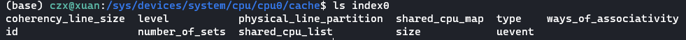
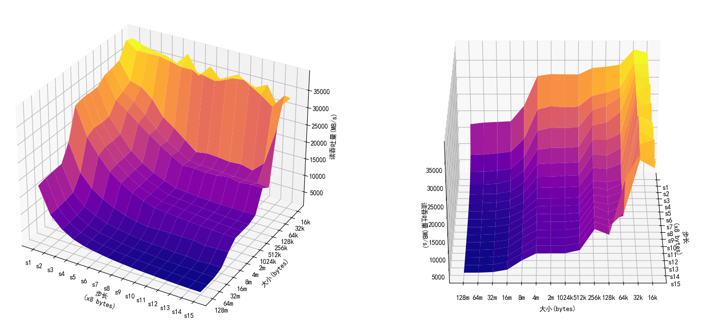
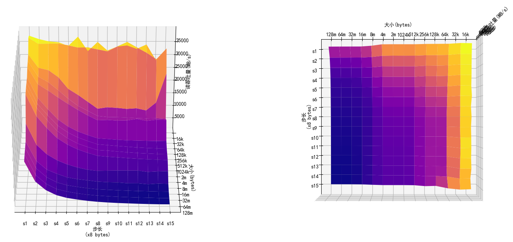

Memory-Mountain实验。

参考资料：

- [CS:APP3e, Bryant and O'Hallaron (cmu.edu)](http://csapp.cs.cmu.edu/3e/students.html)

<!-- more -->

## 一、列出cache参数

```shell
> lscpu
...
L1d cache:                       192 KiB
L1i cache:                       192 KiB
L2 cache:                        1.5 MiB
L3 cache:                        9 MiB
...
```

本机共6个cpu（cpu0-5)。每个cpu目录下，都有它能够使用的cache的信息：




下面以cpu0和cpu1为例，列出它们各自cache的信息。

cpu0可以使用的四个缓存的各项参数如下表所示：

|                         | index0 | index1      | index2  | index3  |
| ----------------------- | ------ | ----------- | ------- | ------- |
| id                      | 0      | 0           | 0       | 0       |
| level                   | 1      | 1           | 2       | 3       |
| type                    | Data   | Instruction | Unified | Unified |
| size                    | 32K    | 32K         | 256K    | 9216K   |
| coherency_line_size     | 64     | 64          | 64      | 64      |
| number_of_sets          | 64     | 64          | 1024    | 12288   |
| physical_line_partition | 1      | 1           | 1       | 1       |
| shared_cpu_list         | 0      | 0           | 0       | 0-5     |
| shared_cpu_map          | 01     | 01          | 01      | 3f      |
| ways_of_associativity   | 8      | 8           | 4       | 12      |

cpu1可以使用的四个缓存的各项参数如下表所示：

|                         | index0 | index1      | index2  | index3  |
| ----------------------- | ------ | ----------- | ------- | ------- |
| id                      | 1      | 1           | 1       | 1       |
| level                   | 1      | 1           | 2       | 3       |
| type                    | Data   | Instruction | Unified | Unified |
| size                    | 32K    | 32K         | 256K    | 9216K   |
| coherency_line_size     | 64     | 64          | 64      | 64      |
| number_of_sets          | 64     | 64          | 1024    | 12288   |
| physical_line_partition | 1      | 1           | 1       | 1       |
| shared_cpu_list         | 1      | 1           | 1       | 0-5     |
| shared_cpu_map          | 02     | 02          | 02      | 3f      |
| ways_of_associativity   | 8      | 8           | 4       | 12      |

### 二、绘制存储器山





首先运行mountain程序，并将输出结果重定向到`mountain.txt`中

```
./mountain > mountain.txt
```

使用python读取输出结果并绘制图像，代码如下：

```python
import numpy as np
import matplotlib.pyplot as plt
from mpl_toolkits.mplot3d import Axes3D

plt.rcParams['font.family'] = 'SimHei'

def read_from_file(path):
    z = []
    y_ticklabels = []
    with open("./mountain.txt") as f:
        lines = f.readlines()
        x_ticklabels = lines[2].strip().split('\t')
        for line in lines[3:]:
            line = line.strip().split('\t')
            if len(line) != 0:
                y_ticklabels.append(line[0])
            z.append([int(i) for i in line[1:]])
    return np.array(z) , np.array(x_ticklabels), np.array(y_ticklabels)
            

# 创建一个3D图形对象
fig = plt.figure()
ax1 = fig.add_subplot(121, projection='3d')
ax2 = fig.add_subplot(122, projection='3d')
# 创建网格数据
x = np.arange(15)
y = np.arange(14)
x, y = np.meshgrid(x, y)
z, x_ticklabels , y_ticklabels = read_from_file("./mountain.txt")

# 绘制3D曲面图，应用颜色映射
colormap = plt.get_cmap('plasma')
for ax in [ax1, ax2]:
    surf = ax.plot_surface(x, y, z, cmap=colormap)

    # 设置轴标签
    ax.set_xlabel('步长\n(x8 bytes)')
    ax.set_ylabel('大小(bytes)')
    ax.set_zlabel('读吞吐量(MB/s)')

    ax.set_xticks(range(len(x_ticklabels)))
    ax.set_yticks(range(len(y_ticklabels)))
    ax.set_xticklabels(x_ticklabels)
    ax.set_yticklabels(y_ticklabels)

ax2.view_init(azim=0)
# ax1.view_init(azim=-90)
# ax2.view_init(elev=90, azim=0)

# 显示图形
plt.show()
```

## 三、测试数据列表

```plain
Clock frequency is approx. 2904.0 MHz
Memory mountain (MB/sec)
		s1		s2		s3		s4		s5		s6		s7		s8		s9		s10		s11		s12		s13		s14		s15	
128m	17796	10321	7056	5149	4091	3472	2947	2579	2311	2107	1961	1816	1702	1622	1605	
64m		18269	10471	7119	5137	4180	3492	2965	2617	2360	2161	2010	1874	1790	1659	1619	
32m		18473	10803	7407	5383	4282	3653	3123	2727	2522	2320	2173	2033	1935	1833	1785	
16m		18664	11309	8015	6391	5028	4348	3887	3384	3162	3049	2730	2719	2361	2619	2514	
8m		23334	15252	11627	9366	7769	6600	5734	5283	5387	5436	5431	5417	4865	5070	5181	
4m		32108	23975	19482	15685	13245	11416	10047	8906	8554	8300	8006	7752	7572	7403	7259	
2m		32679	24999	20430	16263	13521	11481	10155	8957	8719	8396	8087	7803	7609	7422	7298	
1024k	32602	24671	20300	16291	13646	11716	10301	9007	8708	8384	8090	7798	7574	7428	7316	
512k	32584	24859	20540	16541	13854	11878	10483	9223	8959	8679	8442	8333	8237	8158	8240	
256k	34448	28029	25647	22996	20533	18201	16064	14173	14305	14053	14115	14685	13959	14389	14288	
128k	34831	28976	26846	23784	20530	17720	15774	13799	13400	13327	13176	12946	12802	12891	12650	
64k		35434	30363	29479	26820	22311	19961	17284	14595	15157	14925	14525	14766	13929	16971	28321	
32k		39849	37582	37625	37701	37023	36207	36250	35507	34772	36590	38266	36201	34197	31754	35832	
16k		38872	37582	36710	36376	34976	38485	32987	36487	33241	34721	35155	33880	35525	29545	33381	
```

## 四、存储器山分析

可以比较清晰的看出，存储器山分成了四层，分别对应三级缓存和主存。

且前两道山脊分别对应着L1和L2单个缓存芯片的大小（32k和256k）：


